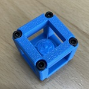

# 続・パンケーキ
- このルールブックは2024年度に生田キャンパスで開催されたF3RCのルールおよびロボカップジュニアレスキューライン(ワールドクラス)のルールを参考に作成しました。F3RC委員に敬意を表します！
# シナリオ
- 21xx年、かつて登戸研究所があった土地でパン屋が開業することとなった。人手不足が深刻化した日本ではロボットが半永久的な労働力としてみなされるようになった。このパン屋も例外ではなく、パン作りの工程を全自動化するつもりだ。近隣の生田農工大学の学生の力も借りて、ほとんどのパンはその製造の全自動化に成功した。しかし、目玉商品のパンケーキは製造設備開発から半年以上が経過した今でも完全な自動化には至っていない。店主はパンケーキの量産体制が整っていないと不安で開店に踏み切れないという。店主を不憫に思ったオートメの新入部員がパンケーキ製造の自動化に向けて動き出す！
# 概要
- ロボットは、異なるパターンのタイルで形成されたモジュール式フィールド内で様々な障害をうまく切り抜けて進みながら、白い床上に描かれた黒線をたどる必要がある。ロボットは自ら周囲の状況を認識することになっているため、チームはロボットにフィールドに関する情報を事前に与えてはいけない。例えば、ロボットは次のようにポイントを獲得する。
  - 交差点または行き止まりのタイルで正しい方向に進めると 10 ポイント。
  - 障害物をうまく切り抜けて進めると 20 ポイント。
  - 1 つ以上のギャップがあるタイルの後で黒線に戻れれば 10 ポイント。
- ロボットがフィールド内で立ち往生した場合は、最後に到達したチェックポイントから再スタートできる。ロボットは新しいチェックポイントに到達するとポイントを獲得する。 通路上のどこかに、壁で囲まれた長方形の部屋(配達ゾーン)が存在する。
# 行動規範
- フェアプレーの精神
  - ルール違反をしないように努める。
- 求められるふるまい
  - フィールドやパンケーキ等、チーム間で共有するものは破損しない、極力劣化させない。
  - ルールをよく読み込み、チームメンバー同士で確認しておくこと。
- チームメンバー
  - チームリーダーを1人置くこと。
  - メンバーは全員がオートメーション研究部の部員である事。
  - 1チーム10人以下であること。
# 用語の定義
| 用語 | 定義 |
| --- | --- |
| パンケーキ | ロボットが運ぶ物体の名称。パンケーキとは名ばかりの、一辺が30mmの立方体に相当する形をした3Dプリンター製キューブである。30g以下である。  |
| フィールド | 競技が行われる場所やそれがある教室全体を指す。特に実際にロボットが走行する部分のことを指す場合が多い。ロボットが走行する部分は主にMDF材で製作される。 |
| タイル | フィールドを構成するMDF製の板で、200mm四方である。表面は塗料で塗装され、白色である。 |
| 配達ゾーン | パンケーキが置かれるべき場所。 |
| 競技開始 | 審判が「競技開始」と言った時点から制限時間のタイマーが動き出す。この時点で競技を開始したものとする。 |
| 得点走行 | 競技開始後、ロボットが走行した結果が実際にチームの得点となる走行のこと。一度始めたらリタイアするまでやめられない。 |
| 試験走行 | 競技開始前に、チームは競技走行をするか試験走行をするか選択できる。試験走行をする場合でも競技開始はする。試験走行ではチームに得点は入らないものの、フィールドにPCを持ち込んでの調整やロボットへのプログラムの書き込み等が認められる。得点走行に移る場合は審判にその旨を伝える。 |
| 進行停止 | 競技開始後、チームリーダーの判断で審判に宣言できる。これを宣言したのち、再び得点走行を開始するまではチームに得点が入らない代わりにロボットに触ることができる。進行停止中もタイマーは進む。 |
| チェックポイント | チームが競技開始前に指定した特定のタイルのこと。競技開始後に進行停止した場合、チームはスタート地点があるタイルまたは最後に通過したチェックポイントにロボットを置き、得点走行を開始することができる。 |
| チェックポイントマーカー | 樹脂製の小さな板。フィールドのタイル上に置くことでそのタイルをチェックポイントとすることができる。 |
| Bon Apetit! | ボナペティと読む(仏語)。パンケーキがすべて配達ゾーンに置かれた状態を指す。これを達成した時点で競技終了となる。 |
# フィールド
- 説明
  - フィールドはほぼ水平な板の上に構築される。
  - フィールドは100mmほどの高さに構築される可能性がある。走行中のロボットの落下に注意する事。
  - タイルのサイズは200mm四方とする。
- タイル表面
  - 白色であり、紙やテープによって作成される。
  - 素材により光沢がある場合がある。
- 黒線
  - 標準的なビニールテープによる。線の太さは19mmである。
- チェックポイント
  - 1回の得点走行につき1箇所のチェックポイントを設けることができる。
  - チェックポイントは1枚のタイルに対して設定できる。
- 障害物
  - 障害物はフィールド上に固定しない。
  - 得点走行中に障害物が倒れた場合、元に戻したり動かしたりすることはできない。
  - 障害物の位置や向きは各得点走行前にリセットされる。
- 交差点と行き止まり
  - 交差点では緑色のマーカーを設置する場合がある(図を参照)。
  - 行き止まりでは緑色のマーカーを2箇所に設置する(図を参照)。
- 配達ゾーン
  - レベルを2段階用意し、各得点走行前に選ぶようにする。
  - パンケーキが配達ゾーン内に収まっていれば配達成功である。
  - 配達ゾーンの面積は50mm * 50mmである。
- パンケーキ
  - ロボットに搭載した状態で得点走行を開始する。
  - パンケーキは3Dプリンター製で30g以下である。
  - パンケーキの外形は一辺30mmの立方体に相当するサイズである。
  - パンケーキを破損させたり、粘着性の物質をつけたりする事は禁止する。
- 環境条件
  - 会場によっては磁場の影響で地磁気センサなどが上手く動作しない可能性がある。
  - 当日は記録用に写真撮影を行うため、赤外線センサが誤動作する可能性がある。
# ロボット
- 制御
  - 自律走行を前提とする。操縦は有線、無線を問わず認めない。
  - 得点走行を開始した後、ロボットを起動するのに必要な動作は1回にすること。例えば、バッテリーを回路に接続するスイッチを入れたらロボットが動き始めるのは良い例である。スイッチを2つ以上操作したり、PCを接続して起動コマンドを送信するなどは悪い例である。
- 安全性
  - ロボットによる事故の原因の多くがバッテリーによるものである。取り扱いには十分に注意すること。
  - 特にLi-Poバッテリーを使用する場合、Li-Poバッテリーの取り扱い講習の受講者がチームに1人いることおよびバッテリーケースの使用を必須とする。
- 製作に使用する部品について
  - 原則支給する。
  - 支給したもの以外(例: 3Dプリンター製パーツやねじ)を使用することも可能。
- 検査
  - 安全性、サイズ、重量の検査をする。
  - 検査に合格しなかったロボットは競技会への参加が認められない。
  - サイズの規定は200mm * 200mm * 200mm以下とする。
  - 重量は1000g以下とする。
  - 安全性の項目にはバッテリーの適切な取り扱いやロボットの処理(ばり取りしてあるか等)を含み、総合的に判断する。
- 違反した場合
  - 処分が重い順に競技進行の停止、減点、得点走行の中止、競技会への参加資格取り消しとする。
# 競技
- チームメンバーの役割について
  - 得点走行中にロボットに触れることができるのはリーダーのみとする。
  - ただしリーダーは競技中にチームメイトと話すことができる。
  - チームリーダーを含め、競技フィールド内に入ることができるのは3人までとする。
- 競技開始
  - 主審または副審が「競技開始」といった時点から開始する。
  - 競技開始後、各チームは得点走行を開始する前に調整時間をとることができる。
  - 調整時間中の走行は得点には反映されない。
  - 調整時間は競技時間に含まれる。
- 得点走行
  - 競技開始し、調整時間をとらない場合はすぐに得点走行が開始される。
  - 得点走行中の走行は得点に反映される。
- 競技進行停止
  - 主審または副審が「進行停止」と言った場合、チームリーダーは速やかにロボットを停止させなければいけない。
  - チームリーダーも「進行停止」と言ってロボットの動きを停止させる権限を持つ。
  - 停止させたロボットはスタート地点または既に通過したチェックポイントから「走行再開」とチームリーダーが言えば再開できる。
  - ただし3回以上進行停止した場合は通過していないチェックポイントから再開することもできる。
- 得点
  - 1タイルの通過につき10点加算。
  - タイルがギミックタイルの場合は更に10点加算。
  - その他、ロボットが動き出したら10点加算、配達ゾーンに入ったら10点加算、"Bon apetit!"達成で30点加算。
# 競技会
- 各チームの評価
  - 各チームの評価は総合得点を基にして順位をつける。
# 公開技術評価
- 説明
  - 一般的に、ロボットコンテストでは競技参加者たちの技術交流会が成長の観点から非常に重要である。
  - 各チームにはロボットの概要を2分で発表してもらう。
- 評価の観点
  - 機構の独創性や動作の安定性を重視する。
# 問題の解決
- 主審と副審
  - 競技中の決定権が最も強いのは主審であり、その次に副審である。
- ルールの明確化
  - ルールについて不明瞭な点や未定義の点があれば質問フォームにて質問すること。
  - 質問フォームは競技3週間前には開設する。
  - 質問をする際、回答内容を他のチームにも公開するかどうかを選択できる。
  - ただし、致命的な質問である場合には回答の公開の希望にかかわらず公開することがある。
- 特殊事項
  - このルールブックでカバーしきれない事象が発生した場合、運営によって公正な立場から判断することがある。
  - このルールブックの解釈は変更される場合がある。
